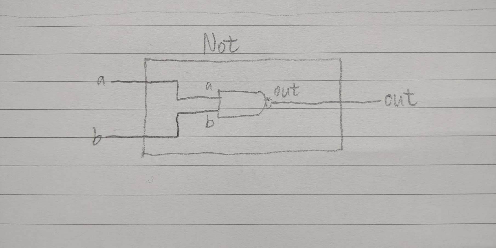
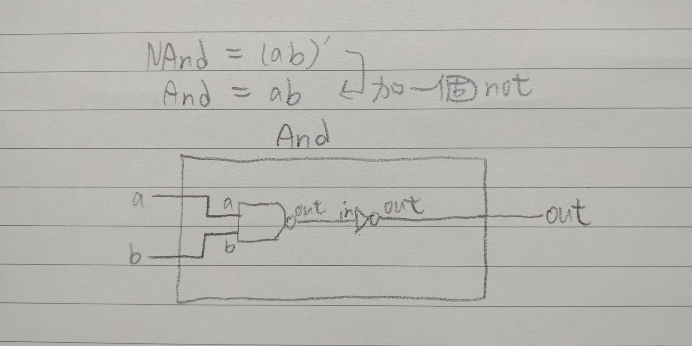
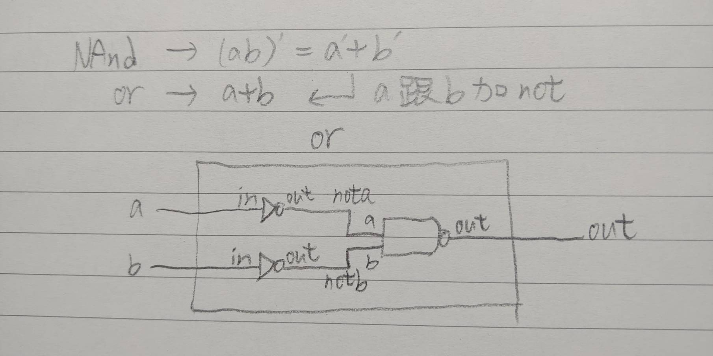

# HW1
### 1. Not
* Picture   

* Code   
<pre>
// This file is part of www.nand2tetris.org
// and the book "The Elements of Computing Systems"
// by Nisan and Schocken, MIT Press.
// File name: projects/01/Not.hdl

/**
 * Not gate:
 * out = not in
 */

CHIP Not {
    IN in;
    OUT out;

    PARTS:
    Nand (a=in, b=in, out=out);
}
</pre>
### 2. And
* Picture   

* Code   
<pre>
// This file is part of www.nand2tetris.org
// and the book "The Elements of Computing Systems"
// by Nisan and Schocken, MIT Press.
// File name: projects/01/And.hdl

/**
 * And gate: 
 * out = 1 if (a == 1 and b == 1)
 *       0 otherwise
 */

CHIP And {
    IN a, b;
    OUT out;

    PARTS:
    Nand (a=a, b=b, out=anandb);
    Not (in=anandb, out=out);
}
</pre>
### 3. Or
* Picture   
   
* Code   
<pre>
// This file is part of www.nand2tetris.org
// and the book "The Elements of Computing Systems"
// by Nisan and Schocken, MIT Press.
// File name: projects/01/Or.hdl

 /**
 * Or gate:
 * out = 1 if (a == 1 or b == 1)
 *       0 otherwise
 */

CHIP Or {
    IN a, b;
    OUT out;

    PARTS:
    Not (in=a, out=nota);
    Not (in=b, out=notb);
    Nand (a=nota, b=notb, out=out);
}
</pre>