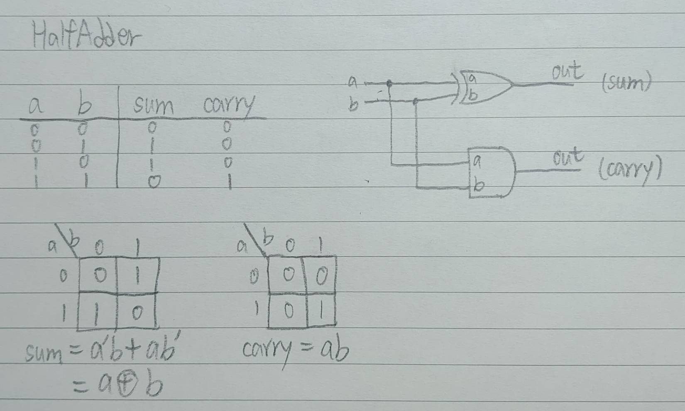
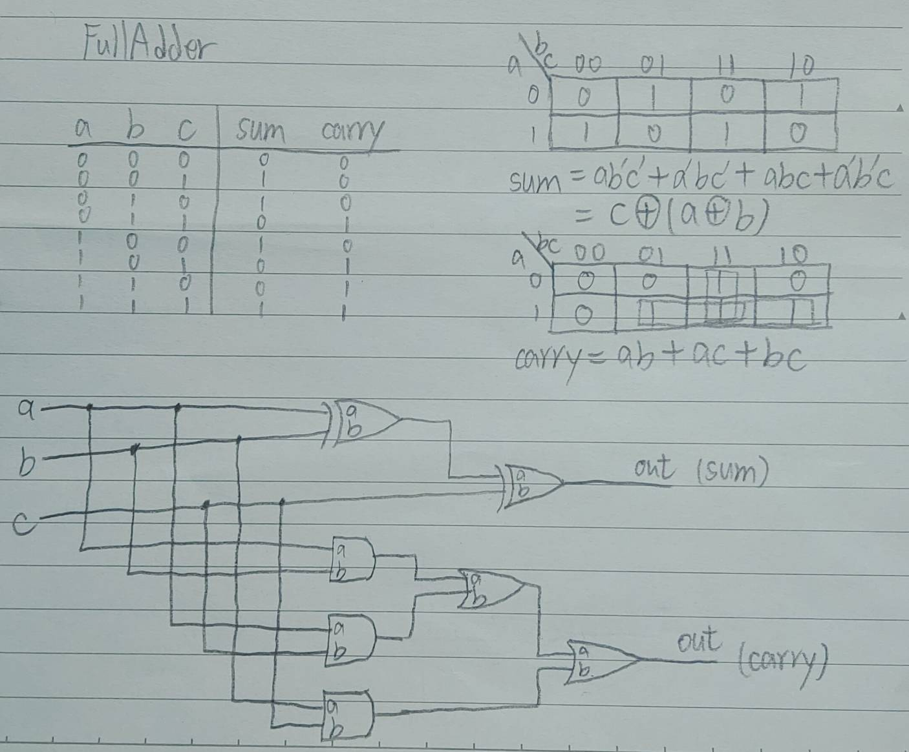
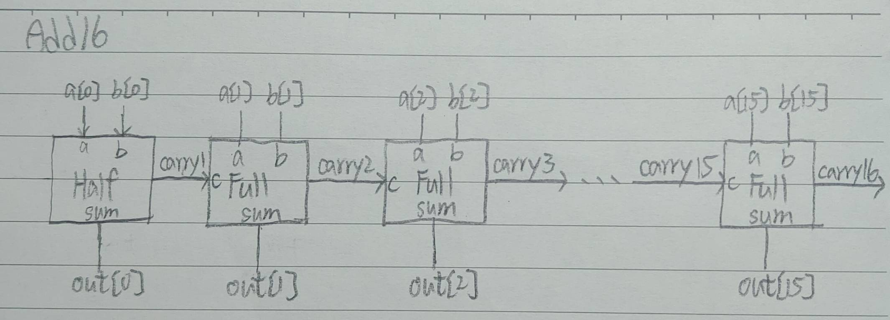
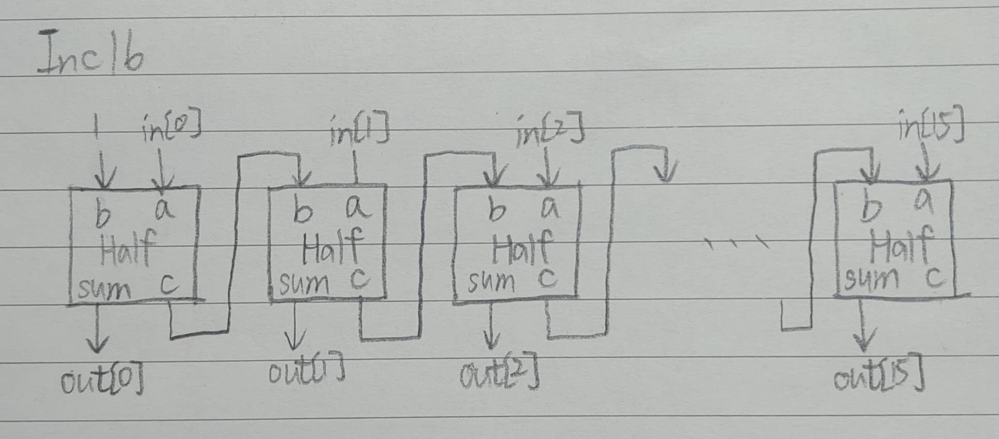

# HW03 - 第二章前四題
### 1. HalfAdder
* Picture   
   
* Code   
<pre>
// This file is part of www.nand2tetris.org
// and the book "The Elements of Computing Systems"
// by Nisan and Schocken, MIT Press.
// File name: projects/02/HalfAdder.hdl

/**
 * Computes the sum of two bits.
 */

CHIP HalfAdder {
    IN a, b;    // 1-bit inputs
    OUT sum,    // Right bit of a + b 
        carry;  // Left bit of a + b

    PARTS:
    // Put you code here:
    Xor(a = a, b = b, out = sum);
    And(a = a, b = b, out = carry);
}
</pre>
---
### 2. FullAdder
* Picture   
   
* Code   
<pre>
// This file is part of www.nand2tetris.org
// and the book "The Elements of Computing Systems"
// by Nisan and Schocken, MIT Press.
// File name: projects/02/FullAdder.hdl

/**
 * Computes the sum of three bits.
 */

CHIP FullAdder {
    IN a, b, c;  // 1-bit inputs
    OUT sum,     // Right bit of a + b + c
        carry;   // Left bit of a + b + c

    PARTS:
    // Put you code here:
    Xor(a = a, b = b, out = axorb);
    Xor(a = axorb, b = c, out = sum);
    And(a = a, b = b, out = aandb);
    And(a = a, b = c, out = aandc);
    And(a = b, b = c, out = bandc);
    Or(a = aandb, b = aandc, out = orabac);
    Or(a = orabac, b = bandc, out = carry);
}
</pre>
---
### 3. Add16
* Picture   
   
* Code   
<pre>
// This file is part of www.nand2tetris.org
// and the book "The Elements of Computing Systems"
// by Nisan and Schocken, MIT Press.
// File name: projects/02/Adder16.hdl

/**
 * Adds two 16-bit values.
 * The most significant carry bit is ignored.
 */

CHIP Add16 {
    IN a[16], b[16];
    OUT out[16];

    PARTS:
   // Put you code here:
   HalfAdder(a = a[0], b = b[0], sum = out[0], carry = carry1);
   FullAdder(a = a[1], b = b[1], c = carry1, sum = out[1], carry = carry2);
   FullAdder(a = a[2], b = b[2], c = carry2, sum = out[2], carry = carry3);
   FullAdder(a = a[3], b = b[3], c = carry3, sum = out[3], carry = carry4);
   FullAdder(a = a[4], b = b[4], c = carry4, sum = out[4], carry = carry5);
   FullAdder(a = a[5], b = b[5], c = carry5, sum = out[5], carry = carry6);
   FullAdder(a = a[6], b = b[6], c = carry6, sum = out[6], carry = carry7);
   FullAdder(a = a[7], b = b[7], c = carry7, sum = out[7], carry = carry8);
   FullAdder(a = a[8], b = b[8], c = carry8, sum = out[8], carry = carry9);
   FullAdder(a = a[9], b = b[9], c = carry9, sum = out[9], carry = carry10);
   FullAdder(a = a[10], b = b[10], c = carry10, sum = out[10], carry = carry11);
   FullAdder(a = a[11], b = b[11], c = carry11, sum = out[11], carry = carry12);
   FullAdder(a = a[12], b = b[12], c = carry12, sum = out[12], carry = carry13);
   FullAdder(a = a[13], b = b[13], c = carry13, sum = out[13], carry = carry14);
   FullAdder(a = a[14], b = b[14], c = carry14, sum = out[14], carry = carry15);
   FullAdder(a = a[15], b = b[15], c = carry15, sum = out[15], carry = carry16);
}
</pre>
---
### 4. Inc16
* Picture   
   
* Code   
<pre>
// This file is part of www.nand2tetris.org
// and the book "The Elements of Computing Systems"
// by Nisan and Schocken, MIT Press.
// File name: projects/02/Inc16.hdl

/**
 * 16-bit incrementer:
 * out = in + 1 (arithmetic addition)
 */

CHIP Inc16 {
    IN in[16];
    OUT out[16];

    PARTS:
   // Put you code here:
   HalfAdder(a = in[0], b = true, sum = out[0], carry = c1);
   HalfAdder(a = in[1], b = c1, sum = out[1], carry = c2);
   HalfAdder(a = in[2], b = c2, sum = out[2], carry = c3);
   HalfAdder(a = in[3], b = c3, sum = out[3], carry = c4);
   HalfAdder(a = in[4], b = c4, sum = out[4], carry = c5);
   HalfAdder(a = in[5], b = c5, sum = out[5], carry = c6);
   HalfAdder(a = in[6], b = c6, sum = out[6], carry = c7);
   HalfAdder(a = in[7], b = c7, sum = out[7], carry = c8);
   HalfAdder(a = in[8], b = c8, sum = out[8], carry = c9);
   HalfAdder(a = in[9], b = c9, sum = out[9], carry = c10);
   HalfAdder(a = in[10], b = c10, sum = out[10], carry = c11);
   HalfAdder(a = in[11], b = c11, sum = out[11], carry = c12);
   HalfAdder(a = in[12], b = c12, sum = out[12], carry = c13);
   HalfAdder(a = in[13], b = c13, sum = out[13], carry = c14);
   HalfAdder(a = in[14], b = c14, sum = out[14], carry = c15);
   HalfAdder(a = in[15], b = c15, sum = out[15]);
}
</pre>