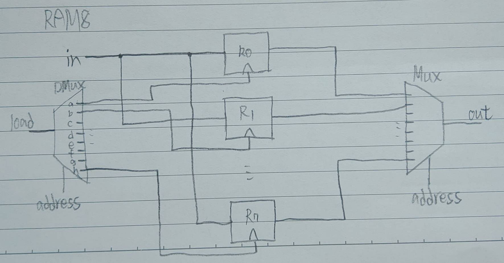
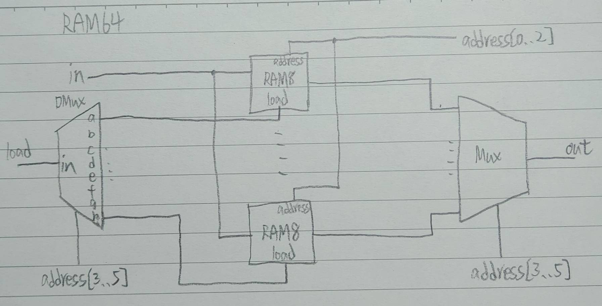
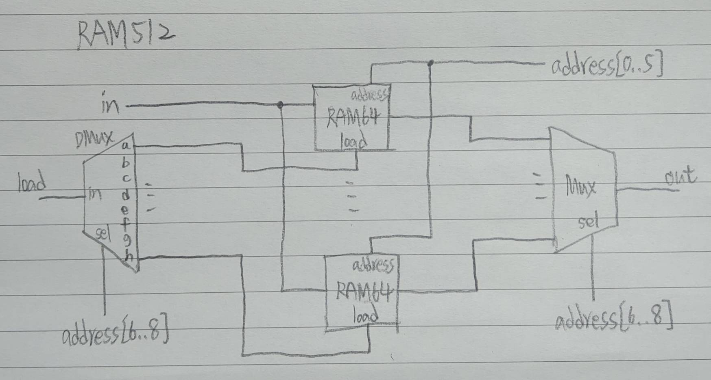
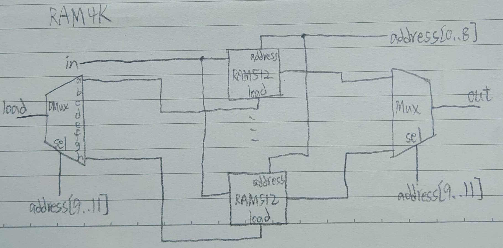
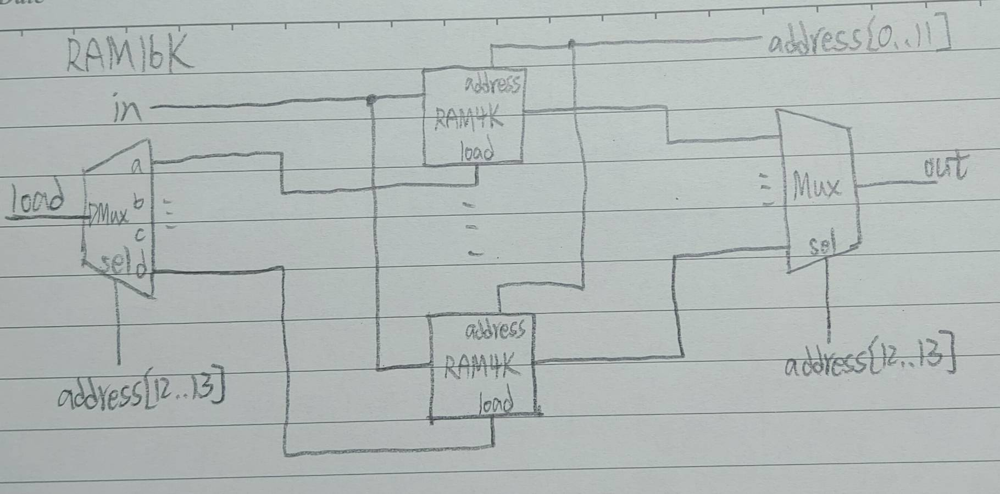

# HW06 - 第三章前4-8題
### 1. RAM8
* Picture   
   
> 8個Register組成
* Code   
<pre>
// This file is part of www.nand2tetris.org
// and the book "The Elements of Computing Systems"
// by Nisan and Schocken, MIT Press.
// File name: projects/03/a/RAM8.hdl

/**
 * Memory of 8 registers, each 16 bit-wide. Out holds the value
 * stored at the memory location specified by address. If load==1, then 
 * the in value is loaded into the memory location specified by address 
 * (the loaded value will be emitted to out from the next time step onward).
 */

CHIP RAM8 {
    IN in[16], load, address[3];
    OUT out[16];

    PARTS:
    // Put your code here:
    DMux8Way(in = load, sel = address, a = r0, b = r1, c = r2, d = r3, e = r4, f = r5, g = r6, h = r7);

    Register(in = in, load = r0, out = r0out);
    Register(in = in, load = r1, out = r1out);
    Register(in = in, load = r2, out = r2out);
    Register(in = in, load = r3, out = r3out);
    Register(in = in, load = r4, out = r4out);
    Register(in = in, load = r5, out = r5out);
    Register(in = in, load = r6, out = r6out);
    Register(in = in, load = r7, out = r7out);

    Mux8Way16(a = r0out, b = r1out, c = r2out, d = r3out, e = r4out, f = r5out, g = r6out, h = r7out, sel = address, out = out);
}
</pre>
---
### 2. RAM64
* Picture   
   
> 8個RAM8(64個Register)組成   
* Code
<pre>
// This file is part of www.nand2tetris.org
// and the book "The Elements of Computing Systems"
// by Nisan and Schocken, MIT Press.
// File name: projects/03/a/RAM64.hdl

/**
 * Memory of 64 registers, each 16 bit-wide. Out holds the value
 * stored at the memory location specified by address. If load==1, then 
 * the in value is loaded into the memory location specified by address 
 * (the loaded value will be emitted to out from the next time step onward).
 */

CHIP RAM64 {
    IN in[16], load, address[6];
    OUT out[16];

    PARTS:
    // Put your code here:
    DMux8Way(in = load, sel = address[3..5], a = r0, b = r1, c = r2, d = r3, e = r4, f = r5, g = r6, h = r7);

    RAM8(in = in, load = r0, address = address[0..2], out = r0out);
    RAM8(in = in, load = r1, address = address[0..2], out = r1out);
    RAM8(in = in, load = r2, address = address[0..2], out = r2out);
    RAM8(in = in, load = r3, address = address[0..2], out = r3out);
    RAM8(in = in, load = r4, address = address[0..2], out = r4out);
    RAM8(in = in, load = r5, address = address[0..2], out = r5out);
    RAM8(in = in, load = r6, address = address[0..2], out = r6out);
    RAM8(in = in, load = r7, address = address[0..2], out = r7out);

    Mux8Way16(a = r0out, b = r1out, c = r2out, d = r3out, e = r4out, f = r5out, g = r6out, h = r7out, sel = address[3..5], out = out);
}
</pre>
---
### 3. RAM512
* Picture   
   
> 8個RAM64(512個Register)組成   
* Code   
<pre>
// This file is part of the materials accompanying the book 
// "The Elements of Computing Systems" by Nisan and Schocken, 
// MIT Press. Book site: www.idc.ac.il/tecs
// File name: projects/03/b/RAM512.hdl

/**
 * Memory of 512 registers, each 16 bit-wide. Out holds the value
 * stored at the memory location specified by address. If load==1, then 
 * the in value is loaded into the memory location specified by address 
 * (the loaded value will be emitted to out from the next time step onward).
 */

CHIP RAM512 {
    IN in[16], load, address[9];
    OUT out[16];

    PARTS:
    // Put your code here:
    DMux8Way(in = load, sel = address[6..8], a = r0, b = r1, c = r2, d = r3, e = r4, f = r5, g = r6, h = r7);

    RAM64(in = in, load = r0, address = address[0..5], out = r0out);
    RAM64(in = in, load = r1, address = address[0..5], out = r1out);
    RAM64(in = in, load = r2, address = address[0..5], out = r2out);
    RAM64(in = in, load = r3, address = address[0..5], out = r3out);
    RAM64(in = in, load = r4, address = address[0..5], out = r4out);
    RAM64(in = in, load = r5, address = address[0..5], out = r5out);
    RAM64(in = in, load = r6, address = address[0..5], out = r6out);
    RAM64(in = in, load = r7, address = address[0..5], out = r7out);

    Mux8Way16(a = r0out, b = r1out, c = r2out, d = r3out, e = r4out, f = r5out, g = r6out, h = r7out, sel = address[6..8], out = out);
}
</pre>
---
### 4. RAM4K
* Picture   
   
> 8個RAM512組成   
* Code   
<pre>
// This file is part of www.nand2tetris.org
// and the book "The Elements of Computing Systems"
// by Nisan and Schocken, MIT Press.
// File name: projects/03/b/RAM4K.hdl

/**
 * Memory of 4K registers, each 16 bit-wide. Out holds the value
 * stored at the memory location specified by address. If load==1, then 
 * the in value is loaded into the memory location specified by address 
 * (the loaded value will be emitted to out from the next time step onward).
 */

CHIP RAM4K {
    IN in[16], load, address[12];
    OUT out[16];

    PARTS:
    // Put your code here:
    DMux8Way(in = load, sel = address[9..11], a = r0, b = r1, c = r2, d = r3, e = r4, f = r5, g = r6, h = r7);
    
    RAM512(in = in, load = r0, address = address[0..8], out = r0out);
    RAM512(in = in, load = r1, address = address[0..8], out = r1out);
    RAM512(in = in, load = r2, address = address[0..8], out = r2out);
    RAM512(in = in, load = r3, address = address[0..8], out = r3out);
    RAM512(in = in, load = r4, address = address[0..8], out = r4out);
    RAM512(in = in, load = r5, address = address[0..8], out = r5out);
    RAM512(in = in, load = r6, address = address[0..8], out = r6out);
    RAM512(in = in, load = r7, address = address[0..8], out = r7out);

    Mux8Way16(a = r0out, b = r1out, c = r2out, d = r3out, e = r4out, f = r5out, g = r6out, h = r7out, sel = address[9..11], out = out);
}
</pre>
---
### 5. RAM16K
* Picture   
   
> 4個RAM4K組成   
* Code   
<pre>
// This file is part of www.nand2tetris.org
// and the book "The Elements of Computing Systems"
// by Nisan and Schocken, MIT Press.
// File name: projects/03/b/RAM16K.hdl

/**
 * Memory of 16K registers, each 16 bit-wide. Out holds the value
 * stored at the memory location specified by address. If load==1, then 
 * the in value is loaded into the memory location specified by address 
 * (the loaded value will be emitted to out from the next time step onward).
 */

CHIP RAM16K {
    IN in[16], load, address[14];
    OUT out[16];

    PARTS:
    // Put your code here:
    DMux4Way(in = load, sel = address[12..13], a = r0, b = r1, c = r2, d = r3);

    RAM4K(in = in, load = r0, address = address[0..11], out = r0out);
    RAM4K(in = in, load = r1, address = address[0..11], out = r1out);
    RAM4K(in = in, load = r2, address = address[0..11], out = r2out);
    RAM4K(in = in, load = r3, address = address[0..11], out = r3out);

    Mux4Way16(a = r0out, b = r1out, c = r2out, d = r3out, sel = address[12..13], out = out);
}
</pre>