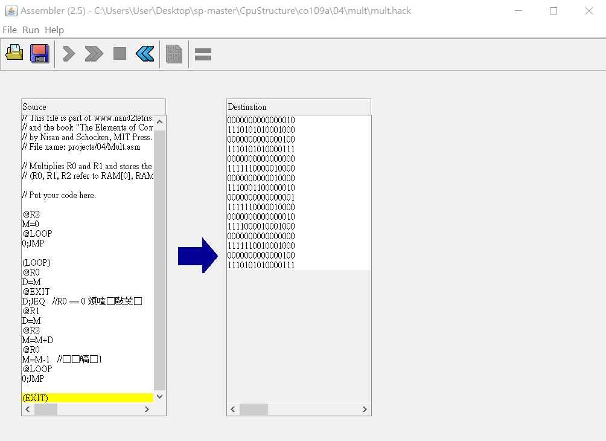
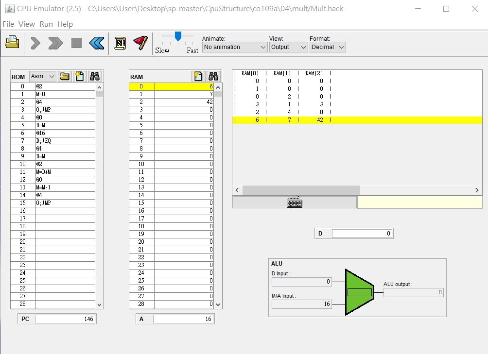

# HW08 - 第四章第一題 Mult.asm
### Mult.asm
* Code   
<pre>
// This file is part of www.nand2tetris.org
// and the book "The Elements of Computing Systems"
// by Nisan and Schocken, MIT Press.
// File name: projects/04/Mult.asm

// Multiplies R0 and R1 and stores the result in R2.
// (R0, R1, R2 refer to RAM[0], RAM[1], and RAM[2], respectively.)

// Put your code here.

@R2
M=0
@LOOP
0;JMP

(LOOP)
@R0
D=M
@EXIT
D;JEQ   //R0 == 0 跳出循環
@R1
D=M
@R2
M=M+D
@R0
M=M-1   //自減1
@LOOP
0;JMP

(EXIT)
</pre>
---
* mult.hack   

---
* Output   

