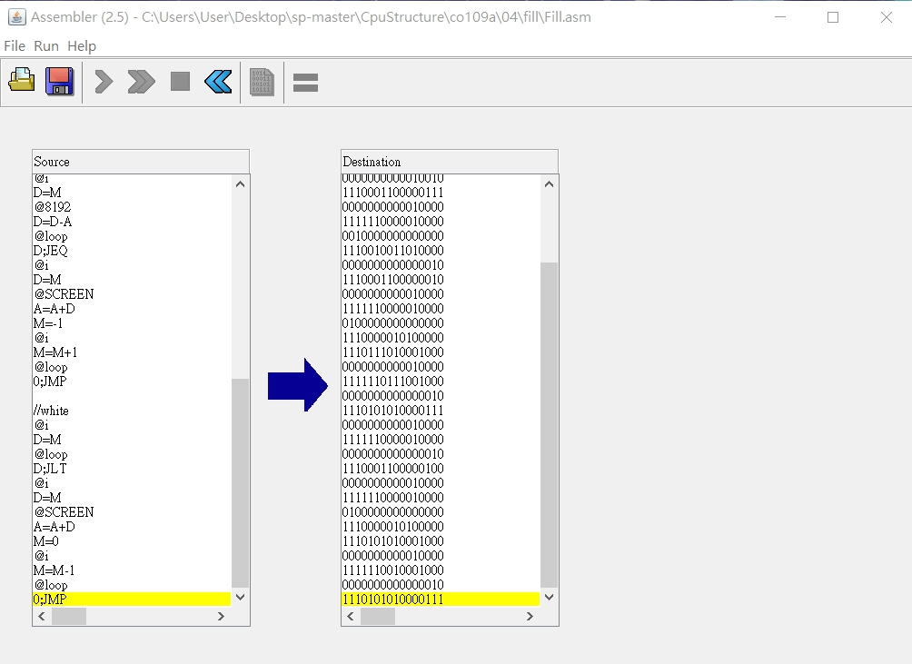
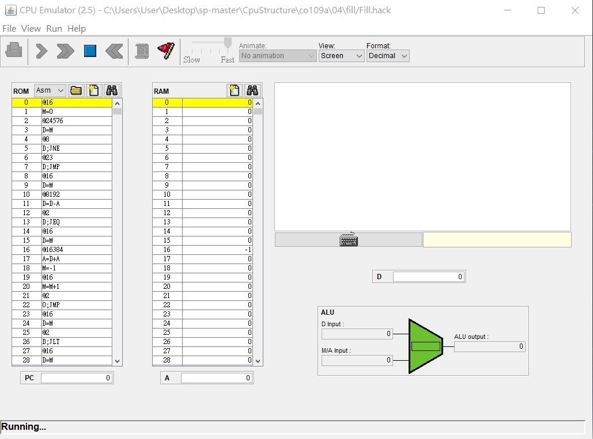
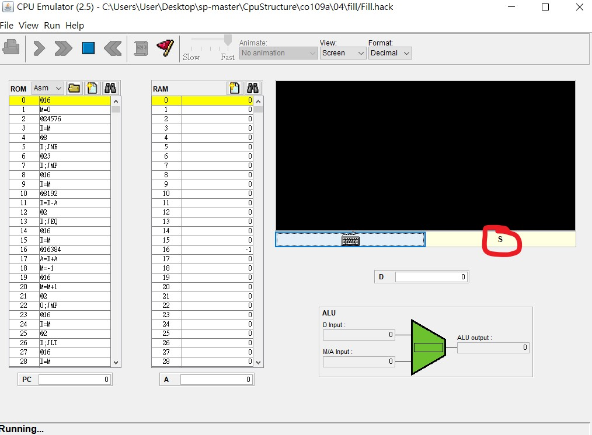

# HW09 - 第四章第二題 Fill.asm
### Fill.asm
* Code   
<pre>
// This file is part of www.nand2tetris.org
// and the book "The Elements of Computing Systems"
// by Nisan and Schocken, MIT Press.
// File name: projects/04/Fill.asm

// Runs an infinite loop that listens to the keyboard input.
// When a key is pressed (any key), the program blackens the screen,
// i.e. writes "black" in every pixel;
// the screen should remain fully black as long as the key is pressed. 
// When no key is pressed, the program clears the screen, i.e. writes
// "white" in every pixel;
// the screen should remain fully clear as long as no key is pressed.

// Put your code here.
@i
M=0

(loop)
@KBD
D=M
@black
D;JNE
@white
D;JMP

//black
@i
D=M
@8192
D=D-A
@loop
D;JEQ
@i
D=M
@SCREEN
A=A+D
M=-1
@i
M=M+1
@loop
0;JMP

//white
@i
D=M
@loop
D;JLT
@i
D=M
@SCREEN
A=A+D
M=0
@i
M=M-1
@loop
0;JMP
</pre>
---
* fill.hack   

   
<pre>
0000000000010000
1110101010001000
0110000000000000
1111110000010000
0000000000001000
1110001100000101
0000000000010111
1110001100000111
0000000000010000
1111110000010000
0010000000000000
1110010011010000
0000000000000010
1110001100000010
0000000000010000
1111110000010000
0100000000000000
1110000010100000
1110111010001000
0000000000010000
1111110111001000
0000000000000010
1110101010000111
0000000000010000
1111110000010000
0000000000000010
1110001100000100
0000000000010000
1111110000010000
0100000000000000
1110000010100000
1110101010001000
0000000000010000
1111110010001000
0000000000000010
1110101010000111
</pre>
---
### Output
* White   

   
* Black

   
> 輸入任意按鍵的時候畫面變黑