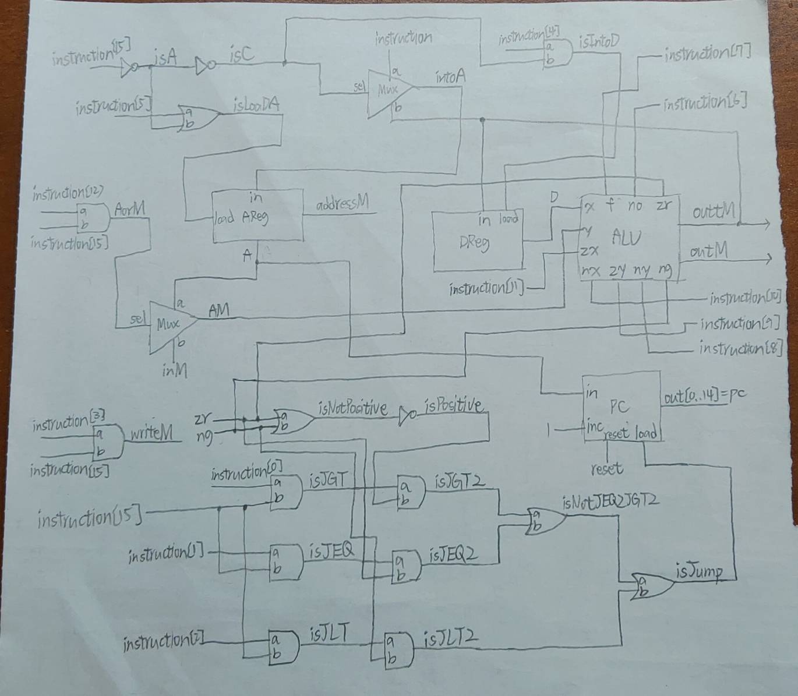

# HW11 - 第五章第2題 CPU.hdl
### CPU
* Picture   
   
* Code   
<pre>
// This file is part of www.nand2tetris.org
// and the book "The Elements of Computing Systems"
// by Nisan and Schocken, MIT Press.
// File name: projects/05/CPU.hdl

/**
 * The Hack CPU (Central Processing unit), consisting of an ALU,
 * two registers named A and D, and a program counter named PC.
 * The CPU is designed to fetch and execute instructions written in 
 * the Hack machine language. In particular, functions as follows:
 * Executes the inputted instruction according to the Hack machine 
 * language specification. The D and A in the language specification
 * refer to CPU-resident registers, while M refers to the external
 * memory location addressed by A, i.e. to Memory[A]. The inM input 
 * holds the value of this location. If the current instruction needs 
 * to write a value to M, the value is placed in outM, the address 
 * of the target location is placed in the addressM output, and the 
 * writeM control bit is asserted. (When writeM==0, any value may 
 * appear in outM). The outM and writeM outputs are combinational: 
 * they are affected instantaneously by the execution of the current 
 * instruction. The addressM and pc outputs are clocked: although they 
 * are affected by the execution of the current instruction, they commit 
 * to their new values only in the next time step. If reset==1 then the 
 * CPU jumps to address 0 (i.e. pc is set to 0 in next time step) rather 
 * than to the address resulting from executing the current instruction. 
 */

CHIP CPU {

    IN  inM[16],         // M value input  (M = contents of RAM[A])
        instruction[16], // Instruction for execution
        reset;           // Signals whether to re-start the current
                         // program (reset==1) or continue executing
                         // the current program (reset==0).

    OUT outM[16],        // M value output
        writeM,          // Write to M? 
        addressM[15],    // Address in data memory (of M)
        pc[15];          // address of next instruction

    PARTS:
    // Put your code here:
    Not(in = instruction[15], out = isA);
    Not(in = isA, out = isC);

    //指令暫存器
    Or(a = instruction[5], b = isA, out = isLoaDA);      //instruction[5]決定是否寫入A暫存器
    //如果是C指令 接受的是上一次指令返回的值 每次指令都直接一個值 但是想要進行兩個數據的相加 能需要拿到上一個指令 用上一個指令和當前指令相加
    //如果是A指令 則A暫存器輸入值直接就是當前instruction
    Mux16(a = instruction, b = outtM, sel = isC, out = intoA);
    ARegister(in = intoA, load = isLoaDA, out[0..14] = addressM, out = A);

    And(a = instruction[12], b = instruction[15], out = AorM);

    Mux16(a = A, b = inM, sel = AorM, out = AM);

    ALU(x = D, y = AM, zx = instruction[11], nx = instruction[10], zy = instruction[9], ny = instruction[8], f = instruction[7], no = instruction[6], out = outtM, out = outM, zr = zr, ng = ng);

    //數據暫存器
    And(a = instruction[4], b = isC, out = isIntoD);      //instruction[4]決定是否寫入D暫存器
    DRegister(in = outtM, load = isIntoD, out = D);

    //d-位域
    And(a = instruction[3], b = instruction[15], out = writeM);

    //j-位域
    Or(a = zr, b = ng, out = isNotPositive);
    Not(in = isNotPositive, out = isPositive);
    And(a = instruction[0], b = instruction[15], out = isJGT);    //out > 0
    And(a = isJGT, b = isPositive, out = isJGT2);

    And(a = instruction[1], b = instruction[15], out = isJEQ);    //out = 0
    And(a = isJEQ, b = zr, out = isJEQ2);
        
    And(a = instruction[2], b = instruction[15], out = isJLT);    //out < 0
    And(a = isJLT, b = ng, out = isJLT2);
        
    Or(a = isJGT2, b = isJEQ2, out = isNotJEQ2JGT2);        
    Or(a = isNotJEQ2JGT2, b = isJLT2, out = isJump);

    //地址暫存器
    PC(in = A, load = isJump, inc = true, reset = reset, out[0..14] = pc);
}
</pre>